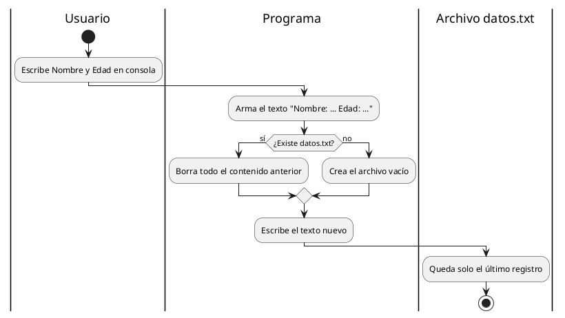

# Crear archivos — `File.WriteAllText`

## Explicación didáctica

**Crear** es tomar lo que el usuario escribe en consola y dejarlo grabado en un `.txt` que sobrevive al cerrar el programa. El método `File.WriteAllText(ruta, texto)` crea el archivo si no existe y **sobrescribe** todo si ya existía.

**Cuándo usarlo:** para el primer guardado o para reiniciar un registro desde cero.

**Cómo se lee:**
- `string ruta = @"C:\...\datos.txt";` → dónde vive el archivo (`@` evita escapar `\`).
- `File.WriteAllText(ruta, "Nombre: " + nombre + "\nEdad: " + edad);` → escribe todo de una vez.
- `Console.ForegroundColor = ConsoleColor.Green;` → solo adorno de consola.

## Diagrama: qué hace `WriteAllText`

Explica el flujo con carriles (quién hace qué) y una decisión (¿existe el archivo?):



**Lectura:** *el rombo decide: si el archivo existe lo vacía, si no lo crea; en ambos casos termina con un solo registro (sobrescribe).*

## Ejemplo 1: crear pidiendo nombre y edad

Pide nombre y edad y los guarda:

```csharp
using System;
using System.IO;

class Program
{
    static void Main()
    {
        Console.Write("Registra tu Nombre: ");
        string nombre = Console.ReadLine();
        Console.Write("Registra tu Edad: ");
        int edad = int.Parse(Console.ReadLine());

        // Crear y escribir en el archivo en la RUTA indicada
        string ruta = @"C:\Users\scarrasc\Documents\Base_datos\datos.txt";
        File.WriteAllText(ruta,
            "Nombre: " + nombre + "\nEdad: " + edad);

        Console.ForegroundColor = ConsoleColor.Green; //Cambia color del texto en la consola
        Console.Write("FELICIDADES!!! - Datos guardados correctamente.");
        Console.ResetColor(); //Color del texto original
        Console.ReadLine();
    }
}
```

**Lectura:** *cada ejecución **borra** lo anterior y deja solo el último nombre/edad.*

## Ejemplo 2: versión portable y segura (complementaria)

El código anterior usa una ruta que puede no existir en otro equipo. Esta versión crea la carpeta donde sí hay permiso:

```csharp
using System;
using System.IO;

class Program
{
    static void Main()
    {
        Console.Write("Registra tu Nombre: ");
        string nombre = Console.ReadLine();
        Console.Write("Registra tu Edad: ");
        if (!int.TryParse(Console.ReadLine(), out int edad))
        {
            Console.WriteLine("Edad inválida. Debe ser un número.");
            return;
        }

        string carpeta = Path.Combine(
            Environment.GetFolderPath(Environment.SpecialFolder.MyDocuments),
            "Base_datos");
        Directory.CreateDirectory(carpeta); // crea si no existe, no falla si existe
        string ruta = Path.Combine(carpeta, "datos.txt");

        File.WriteAllText(ruta, "Nombre: " + nombre + "\nEdad: " + edad);
        Console.WriteLine("Guardado en: " + ruta);
    }
}
```

**Lectura:** *`Directory.CreateDirectory` + `Path.Combine` + `MyDocuments` = funciona en cualquier PC con Windows.*

## Ejemplo completo — construirlo paso a paso

*Objetivo: entender qué hace cada línea antes de copiar.*

### Paso 1 — pedir datos

**Añade:** lectura de consola.

```csharp
Console.Write("Registra tu Nombre: ");
string nombre = Console.ReadLine();
```

### Paso 2 — preparar la ruta

**Añade:** carpeta portable.

```csharp
string carpeta = Path.Combine(
    Environment.GetFolderPath(Environment.SpecialFolder.MyDocuments),
    "Base_datos");
Directory.CreateDirectory(carpeta);
string ruta = Path.Combine(carpeta, "datos.txt");
```

### Paso 3 — escribir (notación completa)

**Añade:** el guardado con `WriteAllText` y validación de edad.

```csharp
if (!int.TryParse(Console.ReadLine(), out int edad)) return;
File.WriteAllText(ruta, "Nombre: " + nombre + "\nEdad: " + edad);
```

**Cómo se lee el Paso 3:** *si la edad no es número, se sale; si es válida, se escribe todo el archivo de golpe.*

## Errores comunes

- **Ruta inexistente** `C:\Users\scarrasc\...`: si la carpeta no existe, el guardado falla. Por eso se usa `MyDocuments` + `Directory.CreateDirectory`.
- Creer que `WriteAllText` "agrega": no, **sobrescribe**. Para agregar usa [[05-modificar-archivos|AppendAllText]].
- `int.Parse` sin `TryParse`: una letra rompe el programa.
- Olvidar `using System.IO;`: sin eso, `File` no existe.
