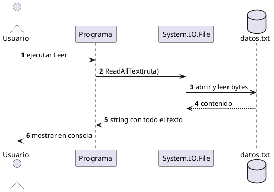

# Leer archivos — `File.ReadAllText` / `ReadAllLines`

## Explicación didáctica

**Leer** es traer de vuelta lo que guardaste: abres `datos.txt` y lo muestras en consola. Tienes dos formas: `File.ReadAllText` devuelve **todo como un solo string**; `File.ReadAllLines` devuelve un **arreglo línea por línea** (ideal para buscar).

**Cuándo usarlo:** para verificar qué hay guardado o para cargarlo a memoria.

**Cómo se lee:**
- `File.ReadAllText(ruta + "datos.txt")` → un bloque de texto.
- `File.ReadAllLines(archivo)` → `string[]` donde `lineas[0]` es la primera línea.

## Diagrama: secuencia de lectura

Muestra el orden temporal: quién le pide a quién, de la consola al disco y de vuelta:



**Lectura:** *el tiempo baja: el usuario pide, el programa delega en `File`, el archivo responde y el texto vuelve hasta la consola.*

## Ejemplo 1: leer todo el archivo de una vez

Lee todo el archivo de una vez y lo imprime:

```csharp
using System;
using System.IO;

class Program
{
    static void Main()
    {
        string ruta = @"C:\Users\scarrasc\Documents\Base_datos\";
        string contenido = File.ReadAllText(ruta+"datos.txt");

        Console.WriteLine(contenido);
        Console.ReadKey();
    }
}
```

**Lectura:** *si el archivo no existe, aquí muere con `FileNotFoundException`; si existe, muestra `Nombre:... Edad:...`.*

## Ejemplo 2: versión segura línea por línea (complementaria)

```csharp
using System;
using System.IO;

class Program
{
    static void Main()
    {
        string archivo = Path.Combine(
            Environment.GetFolderPath(Environment.SpecialFolder.MyDocuments),
            "Base_datos", "datos.txt");

        if (!File.Exists(archivo))
        {
            Console.WriteLine("Aún no hay datos. Crea el archivo primero.");
            return;
        }

        // Opción A: todo junto
        Console.WriteLine(File.ReadAllText(archivo));

        // Opción B: línea por línea (útil para procesar)
        string[] lineas = File.ReadAllLines(archivo);
        for (int i = 0; i < lineas.Length; i++)
            Console.WriteLine((i + 1) + ": " + lineas[i]);
    }
}
```

**Lectura:** *`File.Exists` evita el crash; la opción B numera cada línea para ubicarte.*

## Ejemplo completo — construirlo paso a paso

### Paso 1 — armar la ruta

```csharp
string archivo = Path.Combine(
    Environment.GetFolderPath(Environment.SpecialFolder.MyDocuments),
    "Base_datos", "datos.txt");
```

### Paso 2 — verificar que existe

**Añade:** guardia antes de leer.

```csharp
if (!File.Exists(archivo))
{
    Console.WriteLine("Aún no hay datos.");
    return;
}
```

### Paso 3 — leer y mostrar (notación completa)

**Añade:** las dos formas de lectura.

```csharp
string todo = File.ReadAllText(archivo);      // un string
string[] lineas = File.ReadAllLines(archivo); // arreglo
Console.WriteLine(todo);
```

**Cómo se lee el Paso 3:** *`ReadAllText` para mostrar; `ReadAllLines` cuando después quieras [[04-buscar-en-archivos|buscar]].*

## Errores comunes

- Concatenar rutas con `+` (`ruta+"datos.txt"`): si falta `\` se rompe. Usa `Path.Combine`.
- No comprobar `File.Exists`: el programa explota la primera vez, cuando aún no hay archivo.
- Leer archivos enormes con `ReadAllText`: para archivos grandes usa `File.ReadLines` (perezoso) o `StreamReader`.
