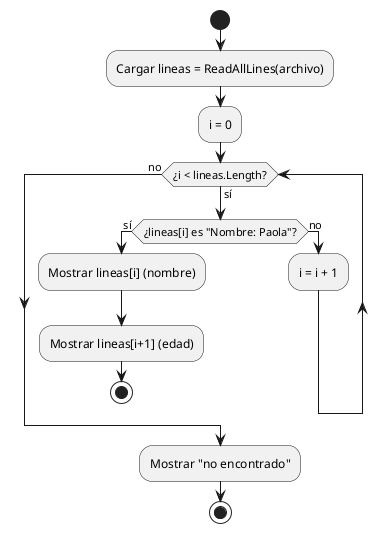

# Buscar en archivos — `File.ReadAllLines` + `for`

## Explicación didáctica

**Buscar** es recorrer el archivo línea por línea hasta encontrar la que te interesa y mostrar también su contexto (en `datos.txt`, la línea siguiente a `Nombre:` siempre es su `Edad:`). Es el mismo `for` de arreglos, pero el arreglo viene del archivo.

**Cuándo usarlo:** para localizar un registro sin cargar objetos ni base de datos.

**Cómo se lee:**
- `File.ReadAllLines(archivo)` → arreglo de líneas.
- `if (lineas[i] == "Nombre: Paola")` → comparación exacta.
- `lineas[i + 1]` → la edad (línea siguiente).

## Diagrama: cómo recorre la búsqueda

Un ciclo `while` que avanza línea a línea hasta coincidir o agotar el archivo:



**Lectura:** *el `while` avanza `i` línea a línea; si coincide muestra el par nombre/edad y corta con `stop`; si el ciclo termina, avisa que no existe.*

## Ejemplo 1: buscar un nombre fijo y mostrar su edad

Busca un nombre concreto y muestra nombre + edad:

```csharp
using System;
using System.IO;
class Program {
    static void Main()
    {
        // Ruta de la carpeta
        string ruta = @"C:\Users\scarrasc\Documents\Base_datos"; // Ruta completa del archivo
        string archivo = Path.Combine(ruta, "datos.txt"); // Leer todo el contenido del archivo
        string[] lineas = File.ReadAllLines(archivo);
        for (int i = 0; i < lineas.Length; i++)
        {
            // Buscar a Paola
            if (lineas[i] == "Nombre: Paola")
            {
                // Mostrar el nombre
                Console.WriteLine(lineas[i]); // Mostrar la edad que está en la línea siguiente
                Console.WriteLine(lineas[i + 1]);
            }
        }
        Console.ReadKey();
    }
}
```

**Lectura:** *si "Paola" no está, no muestra nada (ni avisa); si está en la última línea, `lineas[i+1]` revienta.*

## Ejemplo 2: búsqueda por teclado, sin fallos (complementaria)

```csharp
using System;
using System.IO;

class Program
{
    static void Main()
    {
        string archivo = Path.Combine(
            Environment.GetFolderPath(Environment.SpecialFolder.MyDocuments),
            "Base_datos", "datos.txt");

        if (!File.Exists(archivo)) { Console.WriteLine("Sin datos."); return; }

        Console.Write("Nombre a buscar: ");
        string buscado = Console.ReadLine().Trim();

        string[] lineas = File.ReadAllLines(archivo);
        bool encontrado = false;
        for (int i = 0; i < lineas.Length; i++)
        {
            if (lineas[i].Trim().Equals("Nombre: " + buscado,
                StringComparison.OrdinalIgnoreCase))
            {
                Console.WriteLine(lineas[i]);
                if (i + 1 < lineas.Length)      // guardia contra fin de archivo
                    Console.WriteLine(lineas[i + 1]);
                encontrado = true;
                break;
            }
        }
        if (!encontrado) Console.WriteLine("No se encontró a " + buscado);
    }
}
```

**Lectura:** *ignora mayúsculas/minúsculas, protege `i+1` y avisa si no hay coincidencia.*

## Ejemplo completo — construirlo paso a paso

### Paso 1 — cargar líneas

```csharp
string[] lineas = File.ReadAllLines(archivo);
```

### Paso 2 — recorrer y comparar

**Añade:** el `for` con comparación flexible.

```csharp
for (int i = 0; i < lineas.Length; i++)
{
    if (lineas[i].Trim().Equals("Nombre: " + buscado,
        StringComparison.OrdinalIgnoreCase))
    {
        // ... mostrar ...
    }
}
```

### Paso 3 — mostrar el par nombre/edad (notación completa)

**Añade:** la línea siguiente con guardia + bandera de encontrado.

```csharp
Console.WriteLine(lineas[i]);
if (i + 1 < lineas.Length)
    Console.WriteLine(lineas[i + 1]);
encontrado = true;
break;
```

**Cómo se lee el Paso 3:** *nombre y edad viajan juntos: siempre que encuentres `Nombre:`, la edad está en `i+1` si existe.*

## Errores comunes

- Comparación exacta `== "Nombre: Paola"`: `"paola"`, `" Paola"` o `"Nombre:Paola"` no coinciden. Usa `Trim()` + `OrdinalIgnoreCase`.
- `lineas[i+1]` sin chequear: `IndexOutOfRangeException` si el nombre es la última línea.
- Buscar fijo "Paola" en el código: pide el nombre con `Console.ReadLine()` para reutilizar.
- No avisar cuando no hay coincidencia: el usuario cree que el programa se colgó.
