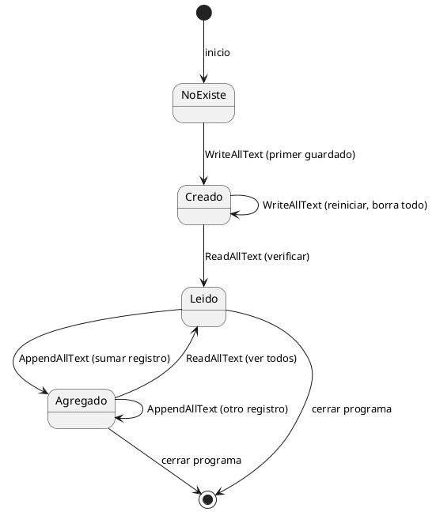

# Agregar a archivos — `File.AppendAllText`

## Explicación didáctica

**Agregar** es sumar un registro nuevo **al final** sin borrar los anteriores. `File.AppendAllText(ruta, texto)` crea el archivo si no existe; si existe, pega tu texto después de lo último. Es la diferencia clave con `WriteAllText` (que borra todo).

**Cuándo usarlo:** para bitácoras, listas y registros que crecen con el tiempo.

**Cómo se lee:**
- `File.AppendAllText(archivo, "\nNombre: " + nombre + "\nEdad: " + edad);` → el `\n` inicial separa del registro anterior.

## Diagrama: ciclo de vida de `datos.txt`

Los estados por los que pasa el archivo según qué método lo toca (`Read` no cambia nada, `Write` reinicia, `Append` suma):



**Lectura:** *`Write` crea o reinicia; `Read` no cambia el estado (solo mira); `Append` suma y se queda en Agregado para seguir creciendo.*

## Ejemplo 1: pedir nombre/edad y pegarlos al final

Pide nombre/edad y los pega al final:

```csharp
using System;
using System.IO;
class Program
{
    static void Main()
    {
        // Ruta de la carpeta
        string ruta = @"C:\Users\scarrasc\Documents\Base_datos"; // Crear la ruta completa del archivo
        string archivo = Path.Combine(ruta, "datos.txt"); // Información que queremos agregar

        Console.Write("Registra tu Nombre: ");
        string nombre = Console.ReadLine();
        Console.Write("Registra tu Edad: ");
        int edad = int.Parse(Console.ReadLine());
        // Agregar información al final del archivo
        File.AppendAllText(archivo,
            "\nNombre: " + nombre + "\nEdad: " + edad);
        Console.ForegroundColor = ConsoleColor.Green; //Cambia color del texto en la consola
        Console.Write("FELICIDADES!!! - Datos guardados correctamente.");
        Console.ResetColor(); //Color del texto original
        Console.ReadLine();
    }
}
```

**Lectura:** *ejecútalo 3 veces y `datos.txt` tendrá 3 bloques `Nombre/Edad` acumulados.*

## Ejemplo 2: agregar con formato consistente (complementario)

El detalle fino: el primer registro no debe empezar con línea vacía.

```csharp
using System;
using System.IO;

class Program
{
    static void Main()
    {
        string archivo = Path.Combine(
            Environment.GetFolderPath(Environment.SpecialFolder.MyDocuments),
            "Base_datos", "datos.txt");
        Directory.CreateDirectory(Path.GetDirectoryName(archivo));

        Console.Write("Registra tu Nombre: ");
        string nombre = Console.ReadLine();
        Console.Write("Registra tu Edad: ");
        if (!int.TryParse(Console.ReadLine(), out int edad))
        { Console.WriteLine("Edad inválida."); return; }

        string bloque = "Nombre: " + nombre + Environment.NewLine + "Edad: " + edad + Environment.NewLine;
        if (File.Exists(archivo) && new FileInfo(archivo).Length > 0)
            bloque = Environment.NewLine + bloque; // separa solo si ya hay contenido
        File.AppendAllText(archivo, bloque);
        Console.WriteLine("Agregado correctamente.");
    }
}
```

**Lectura:** *`Environment.NewLine` funciona en Windows y Linux; el separador extra solo se pone cuando el archivo ya tiene algo.*

## Ejemplo completo — construirlo paso a paso

### Paso 1 — pedir y validar

```csharp
Console.Write("Registra tu Nombre: ");
string nombre = Console.ReadLine();
if (!int.TryParse(Console.ReadLine(), out int edad)) return;
```

### Paso 2 — decidir el separador

```csharp
string bloque = "Nombre: " + nombre + Environment.NewLine + "Edad: " + edad + Environment.NewLine;
if (File.Exists(archivo) && new FileInfo(archivo).Length > 0)
    bloque = Environment.NewLine + bloque;
```

### Paso 3 — agregar (notación completa)

```csharp
File.AppendAllText(archivo, bloque);
```

**Cómo se lee el Paso 3:** *una sola línea que suma sin borrar: esa es toda la magia de `Append` vs `Write`.*

## Errores comunes

- Usar `\n` a mano en Windows: mejor `Environment.NewLine` (`\r\n` en Windows).
- Poner `\n` inicial siempre: deja una línea vacía al inicio cuando el archivo está vacío o no existe.
- Confundir `Write` con `Append`: si tu "historial" solo guarda el último dato, usaste el método equivocado.
- No validar `int.Parse`: igual que en crear, usa `TryParse`.

## Tabla resumen — los 4 métodos

| Quiero... | Método | ¿Borra lo anterior? | ¿Crea el archivo? |
| --- | --- | --- | --- |
| Empezar de cero | `File.WriteAllText` | Sí | Sí |
| Ver todo | `File.ReadAllText` | No (solo lee) | No, falla si no existe |
| Ver por líneas / buscar | `File.ReadAllLines` | No (solo lee) | No, falla si no existe |
| Sumar al final | `File.AppendAllText` | No | Sí |
