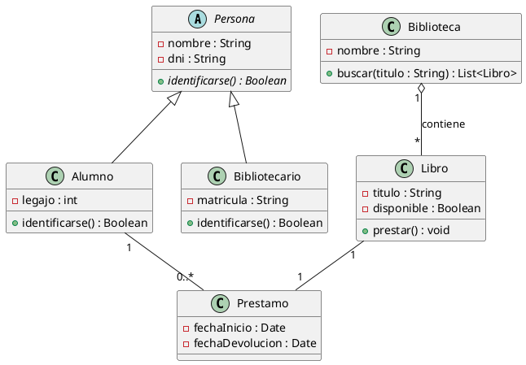
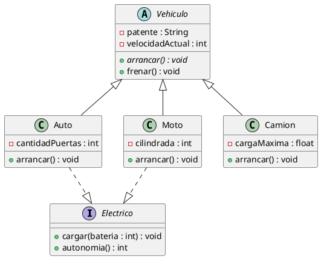
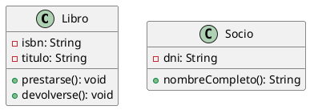
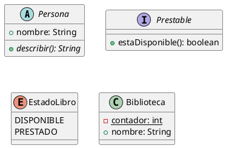
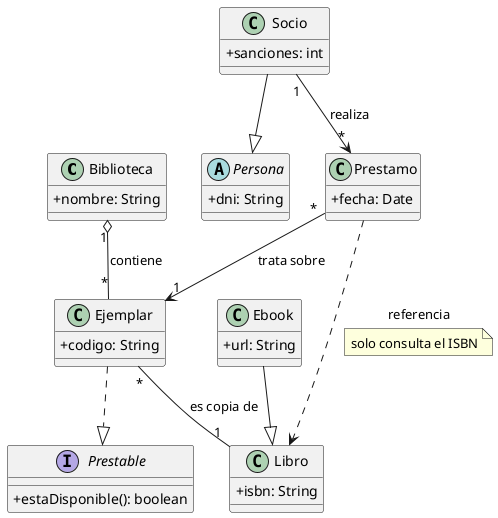

# Diagrama de clases

## Explicación didáctica

El **diagrama de clases** es el más importante de UML: describe la **estructura estática** del sistema en términos de **clases**, sus **atributos** (datos), sus **métodos** (comportamiento) y las **relaciones** entre ellas. Es el plano que después traduces directamente a código (Java, C#, Python...).

**Cuándo usarlo:** para diseñar el dominio del problema, planificar clases antes de programar o documentar cómo se organizan los datos de tu programa.

**Cómo se lee:**
- Un rectángulo dividido en 3 cajones: `nombre` / `atributos` / `métodos`.
- Atributos: `visibilidad nombre : Tipo`. Métodos: `visibilidad nombre(param) : TipoDeRetorno`.
- Visibilidad: `+` público, `-` privado, `#` protegido, `~` paquete.

**Relaciones principales (de menor a mayor acoplamiento):**

| Relación | Notación | Significado |
| --- | --- | --- |
| Asociación | `A --> B` | A usa/conoce a B |
| Agregación | `A o-- B` | A "tiene" B (B puede existir solo) |
| Composición | `A *-- B` | A "posee" B (B no existe sin A) |
| Herencia | `A <\|-- B` | B hereda de A (generalización) |
| Interfaz | `A ..\|> B` | B implementa la interfaz A |
| Dependencia | `A ..> B` | A usa B puntualmente (p.ej. como parámetro) |

**Multiplicidades:** se escriben en los extremos: `1`, `0..1`, `*` (muchos), `1..*`, `2..5`.

## Ejemplo 1: Sistema de biblioteca (asociaciones y multiplicidades)

Muestra una clase abstracta `Persona` con dos subclases, una biblioteca que **agrega** muchos libros y un préstamo que **compone** el vínculo entre libro y usuario.

**Lectura:** *una Biblioteca contiene 1 o muchos Libros (agregación, rombo hueco); un Alumno tiene 0 o muchos Préstamos y cada Prestamo se asocia exactamente a 1 Libro.*

## Ejemplo 2: Vehículos (herencia e interfaces)

**Lectura:** *`Vehiculo` es abstracta (no se instancia); `Auto` y `Moto` heredan de ella **e implementan** la interfaz `Electrico` (rombo punteado).*

## Ejemplo completo — construirlo paso a paso

*Objetivo: modelar una biblioteca usando **toda la notación de diagrama de clases**: clases con interior, clasificadores (interfaz, abstracto, enumeración) y todas las relaciones.*

### Paso 1 — las clases con su interior

**Añade:** el cajón `class`, la **visibilidad** (`-` privado, `+` público) y los miembros con tipo.

### Paso 2 — clasificadores

**Añade:** `abstract class` con método `{abstract}`, `interface`, `enum` y el modificador `{static}`.

### Paso 3 — todas las relaciones (notación completa)

**Añade:** agregación `o--`, composición `*--`, herencia `--|>`, realización `..|>`, dependencia `..>`, multiplicidades `"1"/"*"`, sentido de lectura `-->`, notas y nota sobre un enlace.

**Cómo se lee el Paso 3:** el rombo hueco de `contiene` dice "la biblioteca agrega ejemplares, pero cada ejemplar tiene vida propia"; si fuera `*--` (rombo relleno) sería composición: sin biblioteca, el ejemplar dejaría de existir.

## Errores comunes

- Poner `*` en **ambos** extremos de una asociación sin explicación: define bien cuántos hay de cada lado.
- Confundir **agregación** (rombo hueco) con **composición** (rombo relleno): si al borrar el contenedor el contenido desaparece, es composición.
- Dibujar métodos privados como `-` pero olvidar que en el código también serán privados: la notación debe reflejar el código real.
