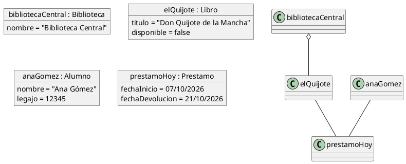
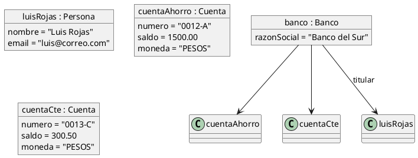

# Diagrama de objetos

## Explicación didáctica

El **diagrama de objetos** muestra **instancias concretas** de las clases en un **momento específico** del tiempo: una "fotografía" o *snapshot* del sistema en ejecución. Mientras el diagrama de clases dice *"existe la clase Alumno"*, el de objetos dice *"la alumna Ana, legajo 12345, tiene estas cuentas"*.

**Cuándo usarlo:**
- Para explicar **ejemplos concretos** de un diseño (ideal para estudiar y para tests).
- Para verificar que las **multiplicidades** del diagrama de clases son correctas.
- En análisis: para mostrar el estado de los datos de un caso de uso.

**Notación clave:**
- Rectángulo con el nombre del objeto **subrayado**: `JuanPerez : Alumno` (instancia `JuanPerez` de la clase `Alumno`).
- Los **atributos** muestran sus **valores**: `dni = "30.111.222"`.
- Los enlaces entre objetos se llaman **enlaces (links)** y pueden llevar el nombre de la asociación.

> [!tip] Regla de oro
> En un diagrama de objetos **nunca** aparecen clases "suelas" ni métodos: solo instancias y sus valores en ese instante.

## Ejemplo 1: Préstamo en una biblioteca

**Lectura:** *en este instante, la Biblioteca Central tiene el libro "Don Quijote" (prestado, `disponible = false`) y existe un préstamo que une a Ana Gómez con ese libro.*

## Ejemplo 2: Cuentas bancarias (una clase, varias instancias)

**Lectura:** *dos instancias distintas de la misma clase `Cuenta` con valores diferentes, ambas bajo el mismo `Banco`.*

## Errores comunes

- Escribir **métodos** en los objetos: los objetos de UML muestran estado (atributos con valor), no comportamiento.
- Olvidar el **subrayado** del nombre: sin subrayado ya no es un objeto, es una clase.
- Mezclar en un mismo diagrama clases y objetos sin separarlos: si necesitas ambos, usa un diagrama de clases enriquecido con instancias.
