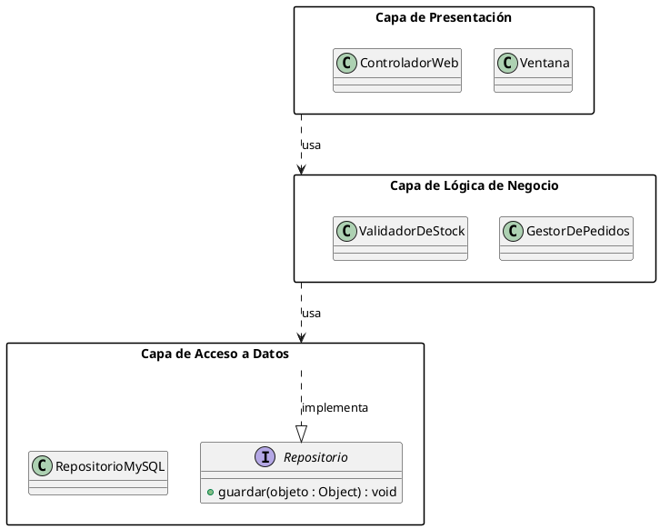
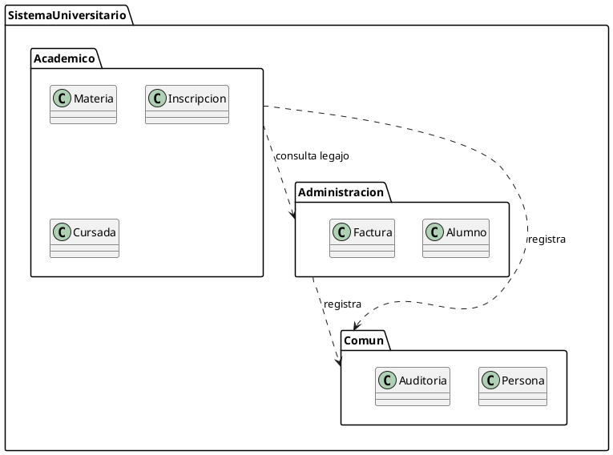

# Diagrama de paquetes

## Explicación didáctica

El **diagrama de paquetes** agrupa elementos (clases, otros paquetes, componentes) en **módulos** para organizar sistemas grandes. Es el mapa de carpetas de tu proyecto: evita el "código espagueti" mostrando qué módulos existen y **cuáles dependen de cuáles**.

**Cuándo usarlo:**
- Al inicio de un diseño para definir la **arquitectura por capas** o módulos.
- Para detectar **dependencias circulares** (A → B → A), un síntoma de mal diseño.
- Para explicar un proyecto grande sin abrumar con todas sus clases.

**Notación:**
- **Carpeta** con pestaña: `package "Nombre" { ... }`.
- Las **dependencias** punteadas con flecha `..>` indican que el origen usa al destino.
- Las **relaciones de importación** (`..>`) entre paquetes suelen significar "este paquete importa clases de aquel".
- Un paquete puede contener **subpaquetes** anidados.

**Buenas prácticas:**
- Los paquetes deben tener **una sola responsabilidad** (no metas todo en `Utilidades`).
- Las flechas deben apuntar "hacia abajo" (presentación → lógica → datos), nunca al revés.

## Ejemplo 1: Arquitectura en tres capas

**Lectura:** *la presentación depende de la lógica; la lógica depende de los datos; `RepositorioMySQL` implementa la interfaz `Repositorio`. Las flechas nunca van hacia arriba.*

## Ejemplo 2: Sistema universitario con subpaquetes

**Lectura:** *`SistemaUniversitario` contiene tres subpaquetes; `Academico` consulta datos de `Administracion` y ambos usan elementos `Comun`.*

## Errores comunes

- **Dependencias circulares** entre paquetes: si A depende de B y B de A, extrae una interfaz o una tercera capa `Comun`.
- Paquetes con **demasiadas clases** (más de ~20): probablemente necesites dividirlo.
- Usar paquetes solo por capas de carpetas del IDE sin significado real: el paquete UML representa **responsabilidad**, no ubicación física.
