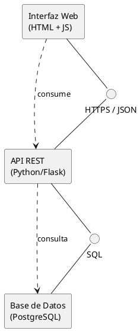
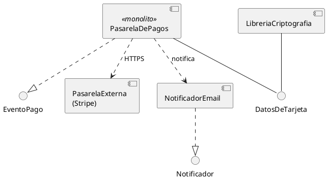

# Diagrama de componentes

## Explicación didáctica

El **diagrama de componentes** muestra las **piezas físicas del software** (componentes) y cómo se conectan entre sí a través de **interfaces**. Un *componente* es una unidad reemplazable del sistema con interfaces bien definidas: un servicio REST, una librería, un módulo, un microservicio.

**Cuándo usarlo:**
- Para modelar la **arquitectura de software** (piezas + contratos).
- Antes de un refactor: obliga a pensar en **interfaces**, no en implementaciones.
- Para documentar sistemas embebidos o basados en frameworks.

**Notación:**
- Componente: rectángulo con la **interfaz en el borde** (icono de "pastilla"/reloj de arena) o el estereotipo `<<component>>`.
- **Interfaz requerida** (pin/bola huerfana) vs. **interfaz provista**: el clásico "ball and socket"; en PlantUML se conecta con `--` y él dibuja la bola/zócalo en el extremo de la interfaz.
- Dependencia entre componentes: `..>`.

**Idea clave:** *un componente es una caja negra: solo importa lo que expone, no cómo está hecho por dentro* (para ver por dentro usarías el diagrama de estructura compuesta).

## Ejemplo 1: Aplicación web en tres piezas

**Lectura:** *la Interfaz Web necesita la interfaz `HTTPS/JSON` que la API REST provee; la API a su vez necesita `SQL`, que provee la Base de Datos. La bola entra en el zócalo: los contratos coinciden.*

## Ejemplo 2: Librerías de un sistema de pagos (estereotipos y dependencias)

**Lectura:** *la pasarela usa criptografía para tratar los datos de tarjeta (interfaz compartida), publica eventos de pago, llama a un servicio externo por HTTPS y notifica por email a través de la interfaz `Notificador`.*

## Errores comunes

- Dibujar **clases** en vez de componentes: si el rectángulo tiene atributos/métodos en 3 cajones, es una clase.
- Conectar componentes **directamente** sin interfaces: en componentes, el acople se hace solo por contratos explícitos.
- Mezclar hardware con software: los servidores y cables pertenecen al diagrama de **despliegue**.
