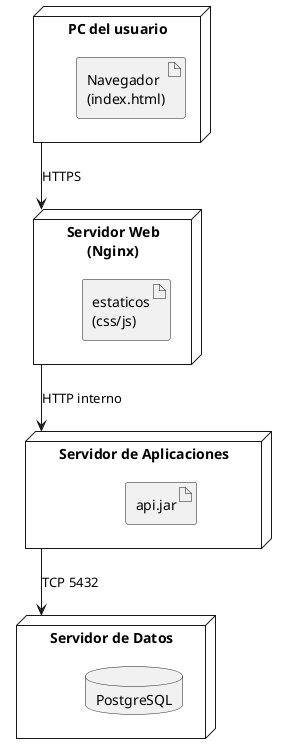
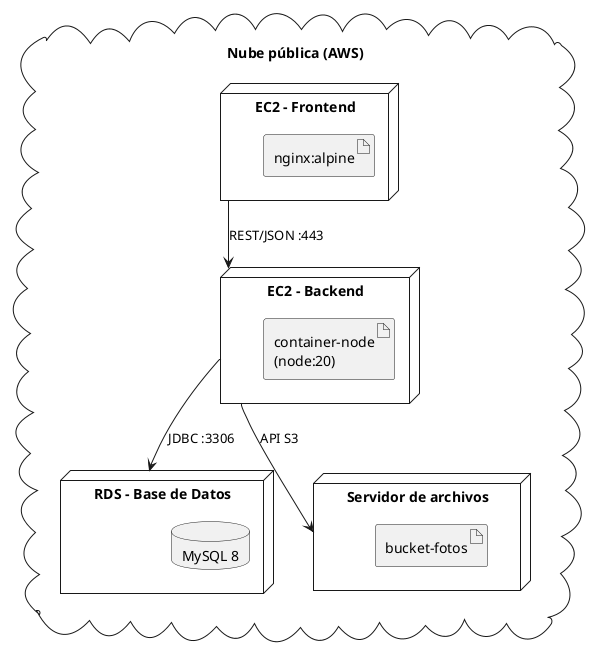

# Diagrama de despliegue

## Explicación didáctica

El **diagrama de despliegue** muestra la **estructura física**: los *nodos* de hardware (servidores, dispositivos, la nube) sobre los que **corren** los artefactos de software (ejecutables, contenedores, bases de datos) y los caminos de comunicación entre ellos.

**Cuándo usarlo:**
- Para planificar la infraestructura (¿dónde corre qué?).
- Para documentar un entorno productivo antes de un examen o una puesta en producción.
- Para explicar arquitecturas cliente-servidor, microservicios o IoT.

**Notación:**
- **Nodo** (`node`): equipo físico o virtual (servidor, celular, PLC).
- **Artefacto** (`artifact`): archivo que se ejecuta/instala (`.jar`, `app.exe`, `index.html`).
- **Base de datos** (`database`), **dispositivo** (`device`), **sistema embebido**.
- Caminos de comunicación con el **protocolo** rotulado: `--> : HTTPS`.

**Diferencia clave:**
- *Componentes* = piezas de **software**.
- *Nodos* = piezas de **hardware/despliegue** donde esas piezas viven.

## Ejemplo 1: Tres servidores (cliente-servidor clásico)

**Lectura:** *el navegador corre en la PC del usuario; Nginx sirve estáticos; `api.jar` corre en el servidor de aplicaciones y habla con PostgreSQL por el puerto 5432.*

## Ejemplo 2: Despliegue en contenedores (Docker / nube)

**Lectura:** *todo vive en la nube: el frontend en un contenedor Nginx, el backend en Node, la base en un servicio gestionado y las imágenes en un bucket.*

## Errores comunes

- Dibujar **clases** dentro de un nodo: dentro de un nodo van **artefactos** (archivos/ejecutables).
- Olvidar los **protocolos y puertos**: un despliegue sin rótulos de comunicación no sirve para operar el sistema.
- Mezclar el **diagrama de componentes** con este: si ves `class` o interfaces, estás en el diagrama equivocado.
