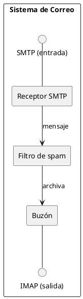
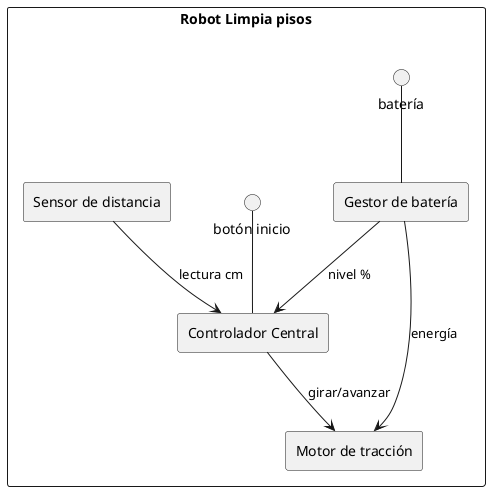

# Diagrama de estructura compuesta

## Explicación didáctica

El **diagrama de estructura compuesta** abre la tapa de un componente/clase y muestra **cómo está hecho por dentro**: sus **partes internas**, sus **puertos** (puntos de conexión en el borde) y los **conectores** que las unen. Responde a la pregunta *"¿qué hay dentro de esta caja y cómo se conecta con el exterior?"*.

**Cuándo usarlo:**
- Cuando un componente es complejo y necesitas mostrar su **arquitectura interna**.
- Para sistemas embebidos, sistemas de control o cualquier componente con entradas/salidas definidas.
- Es el puente entre el diagrama de componentes (exterior) y el de clases (detalle).

**Notación:**
- Un **componente o clase contenedora** con partes anidadas.
- **Puerto**: pequeño cuadrado en el borde; puede ser de **entrada** o **salida**.
- **Conector**: línea entre partes (o entre puerto y parte).
- **Interfaz asambleada**: si dos partes se conectan mediante interfaces complementarias.

**Idea clave:** *las partes no pueden existir sin el todo que las contiene* (composición) y el todo se comunica con el resto del mundo **solo por sus puertos**.

## Ejemplo 1: Sistema de correo con partes internas y puertos

**Lectura:** *el Sistema de Correo expone dos puertos (SMTP e IMAP); por dentro, el Receptor entrega mensajes al Filtro, que los archiva en el Buzón. Fuera de la caja no se ve nada más.*

## Ejemplo 2: Robot con sensores (partes + conectores)

**Lectura:** *el robot tiene 4 partes internas; el Controlador recibe lecturas del sensor y órdenes del botón, y manda órdenes al Motor; el Gestor de batería alimenta a ambos.*

## Errores comunes

- Dibujar **todo el sistema** dentro de un solo componente: la estructura compuesta muestra **un** componente con sus partes, no el mapa completo.
- Conectar partes **ignorando los puertos**: si el exterior debe entrar, debe haber un puerto/interfaz en el borde.
- Confundirlo con un diagrama de **despliegue**: aquí las partes son de **software**, no de hardware.
