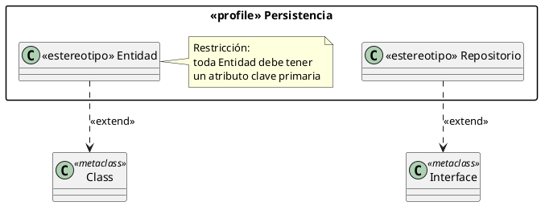
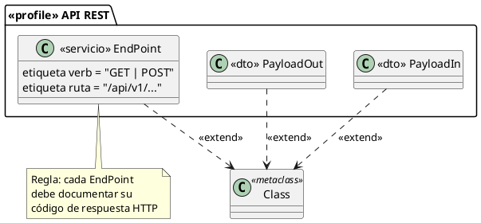

# Diagrama de perfiles

## Explicación didáctica

El **diagrama de perfiles** (*profile*) es el mecanismo de UML para **extender el lenguaje sin romperlo**: define *estereotipos*, *etiquetas* y *restricciones* propios de un dominio (telecomunicaciones, banca, sistemas embebidos...) que se aplican sobre los elementos estándar de UML.

**Cuándo usarlo:**
- Cuando UML "se queda corto" para tu dominio: p.ej. necesitas `<<RESTController>>`, `<<EntidadJPA>>`, `<<dispositivoMedico>>`.
- En equipos que siguen un **perfil corporativo** de modelado (todas las clases de persistencia llevan `<<Entidad>>`).
- Es la forma **legal** de personalizar UML (MDA/OMG).

**Conceptos:**

| Elemento | Qué es | Ejemplo |
| --- | --- | --- |
| **Estereotipo** | Extiende un elemento UML (clase, componente...) | `<<Servicio>>` sobre una clase |
| **Etiqueta** (tag) | Propiedad adicional del estereotipo | `perfilDB = "MySQL"` |
| **Restricción** | Regla que debe cumplirse (*constraint*) | "toda Entidad debe tener PK" |
| **Extensión** | Relación del estereotipo con la **metaclase** que extiende | `Entidad` extiende a `Class` |

**Notación:** un paquete estereotipado como `<<profile>>`, las metaclases de UML (`Class`, `Component`...) y dependencias de extensión punteadas hacia la metaclase.

> [!note] En la práctica
> No se usa en diseño de clases cotidiano: aparece en ingeniería de sistemas, estándares de industria y exámenes de modelado avanzado. PlantUML lo aproxima con paquetes + estereotipos.

## Ejemplo 1: Perfil de persistencia

**Lectura:** *el perfil `Persistencia` define dos estereotipos: `Entidad` extiende a las clases de UML y `Repositorio` extiende a las interfaces.*

## Ejemplo 2: Perfil de servicios web con etiquetas

**Lectura:** *estereotipos `<<servicio>>` y `<<dto>>` con etiquetas (`verb`, `ruta`) y una regla documentada: así un equipo entiende de un vistazo qué es cada clase del modelo.*

## Errores comunes

- Inventar estereotipos **sin definirlos antes** en el perfil: si no está en el perfil, no existe para UML.
- Usar estereotipos como **sinónimos de clases** (`<<ClaseServicio>>` que en realidad es una clase): el estereotipo **adorna** un elemento, no lo reemplaza.
- Confundir un perfil con un **paquete normal**: el perfil va dirigido `<<profile>>` y solo extiende la metaclase (no agrega clases al modelo de usuario).
