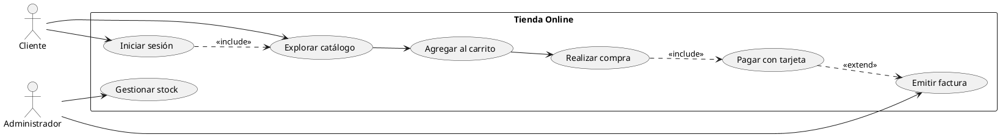
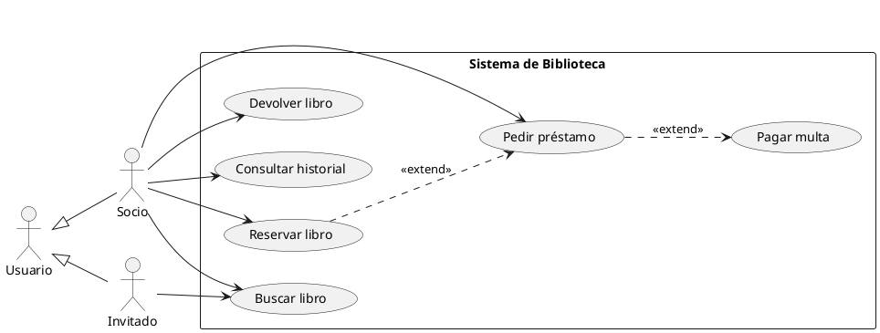
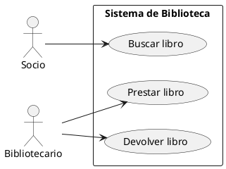
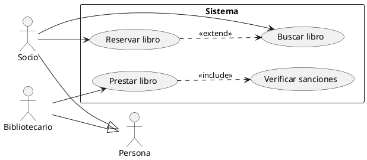
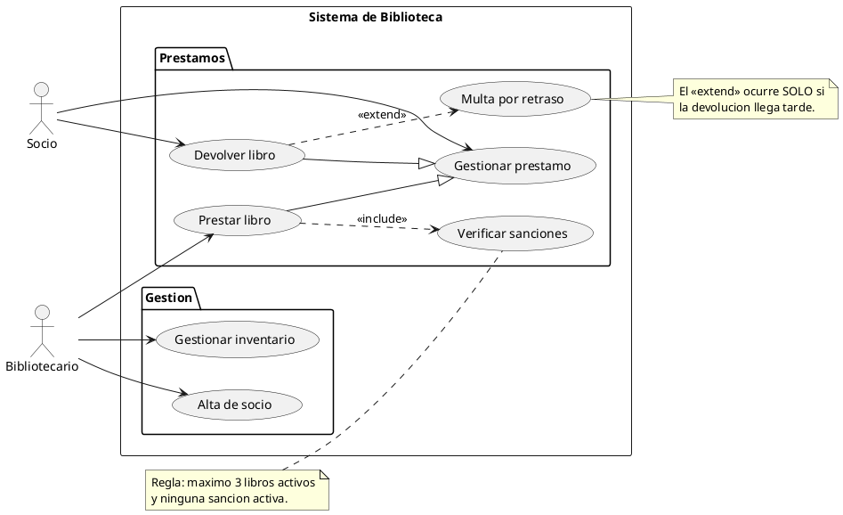

# Diagrama de casos de uso

## Explicación didáctica

El **diagrama de casos de uso** captura el sistema **desde el punto de vista del usuario**: qué pueden *hacer* los actores con el sistema. Es el primer diagrama de un proyecto porque define el **alcance** (scope) y los **requisitos funcionales**.

**Cuándo usarlo:**
- Al inicio del análisis: levantamiento de requisitos con el cliente.
- Para delimitar qué entra y qué no entra en la primera versión.
- Para escribir pruebas: cada caso de uso genera escenarios de prueba.

**Notación:**
- **Actor**: figura de "palito" — persona u otro sistema que interactúa (puede ser `<<sistema>>`).
- **Caso de uso**: elipse con verbo en infinitivo: *Realizar pedido*, *Emitir factura*.
- **Frontera del sistema**: rectángulo que contiene los casos de uso.
- Relaciones:
  - `actor --> caso`: **participación**.
  - `casoA ..> casoB : <<include>>`: A **siempre** ejecuta B (obligatorio).
  - `casoA ..> casoB : <<extend>>`: B **puede** ocurrir en A bajo cierta condición (opcional).
  - `caso <|-- caso`: **generalización** de casos de uso.

> [!tip] Cómo escribirlos bien
> Siempre en **infinitivo** y desde la perspectiva del actor: *"Registrar usuario"*, nunca *"El usuario hace clic en..."*.

## Ejemplo 1: Sistema de e-commerce

**Lectura:** *el Cliente necesita iniciar sesión para explorar (include = siempre); pagar es parte obligatoria de la compra; la factura se emite **solo si** el cliente la solicita (extend = opcional).*

## Ejemplo 2: Biblioteca con actores y generalización

**Lectura:** *el Invitado solo busca; el Socio puede todo; reservar solo termina en préstamo si hay disponibilidad (extend) y la multa aparece únicamente si hay retraso.*

## Ejemplo completo — construirlo paso a paso

*Objetivo: modelar la biblioteca con **toda la notación de casos de uso**: frontera, actores con generalización, casos base, `<<include>>`, `<<extend>>`, generalización de casos, paquetes y notas.*

### Paso 1 — actores y casos básicos

**Añade:** actores, frontera `rectangle` del sistema y casos de uso enlazados con participación.

### Paso 2 — include, extend y generalización de actores

**Añade:** `<<include>>` (obligatorio), `<<extend>>` (opcional con condición) y la **generalización de actores** `--|>`.

### Paso 3 — notación completa (paquetes, generalización de casos y notas)

**Añade:** casos agrupados en **paquetes**, **generalización entre casos de uso** (triángulo `--|>`) y notas con las reglas de negocio.

**Cómo se lee el Paso 3:** `Prestar` y `Devolver` **son casos especializados** de `Gestionar prestamo` (triángulo `--|>`), los `<<include>>`/`<<extend>>` llevan su etiqueta con la condición escrita en la nota y los casos están agrupados en paquetes temáticos.

## Errores comunes

- Poner **pantallas o botones** como casos de uso (*"Hacer clic en Aceptar"*): el caso de uso es la **intención del usuario**, no la interfaz.
- Usar `<<extend>>` donde en realidad es obligatorio: si **siempre** pasa, es `<<include>>`.
- Dibujar al actor dentro del rectángulo del sistema: el actor está **fuera** de la frontera.
