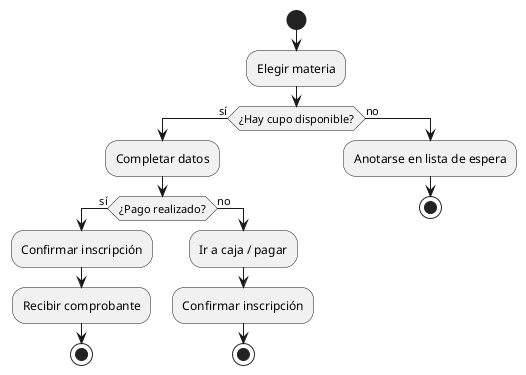
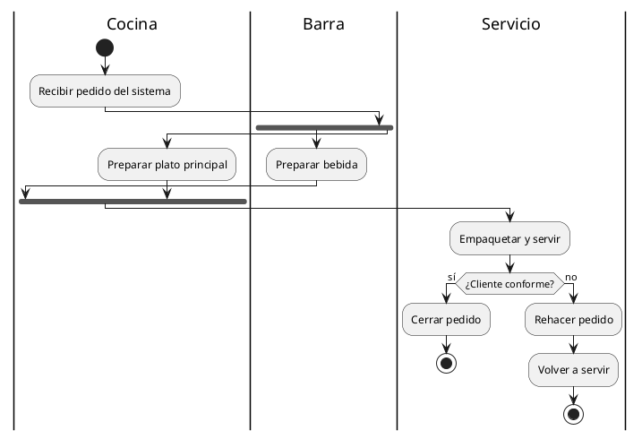

# Diagrama de actividades

## Explicación didáctica

El **diagrama de actividades** modela el **flujo de trabajo** (workflow): actividades, decisiones, paralelismos y responsables. Es casi un flowchart, pero con la notación semántica de UML: ideal para describir **procesos de negocio** o la lógica interna de un caso de uso.

**Cuándo usarlo:**
- Para describir **cómo se cumple** un caso de uso paso a paso.
- Para procesos con **condiciones** (`if`), **paralelismo** (`fork`) o **bandas de responsabilidad** (swimlanes).
- Para algoritmos vistos "de alto nivel" antes de programar.

**Notación (sintaxis "nueva" de PlantUML):**

| Elemento | Sintaxis PlantUML |
| --- | --- |
| Inicio / fin | `start` / `stop` |
| Actividad | `:Descripción;` |
| Decisión | `if (condición?) then (sí) ... else (no) ... endif` |
| Bifurcación paralela | `fork ... fork again ... end fork` |
| Banda (swimlane) | `\|Nombre de banda\|` |
| Barra final | `end` (implícito con stop) |
| Subproceso / llamada | `: actividad;` con nota |

**Regla de oro:** el flujo sale del **nodo inicial** (`●`) y termina en uno o varios **finales** (`◉`).

## Ejemplo 1: Inscripción a una materia con decisión

**Lectura:** *dos decisiones encadenadas (cupo y pago) con tres posibles finales; nunca se mezclan caminos sin pasar por sus condiciones.*

## Ejemplo 2: Atención de un pedido con paralelismo (fork)

**Lectura:** *después de recibir el pedido, la bebida y el plato se preparan **en paralelo** (fork); el flujo se sincroniza (join implícito de `end fork`) antes de servir. Las bandas indican quién es responsable de cada actividad.*

## Errores comunes

- Dejar **ramas abiertas**: cada `if` necesita `endif`, cada `fork` necesita `end fork`.
- Decisiones sin **etiqueta de salida** (`(sí)/(no)`): sin rótulos no se sabe qué rama elegir.
- Usar `fork` para alternativas: `fork` es **paralelo**; si solo pasa uno, es `if/else`.
