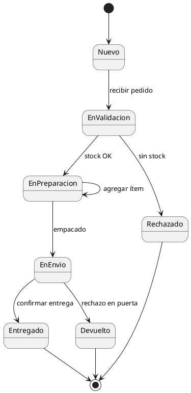
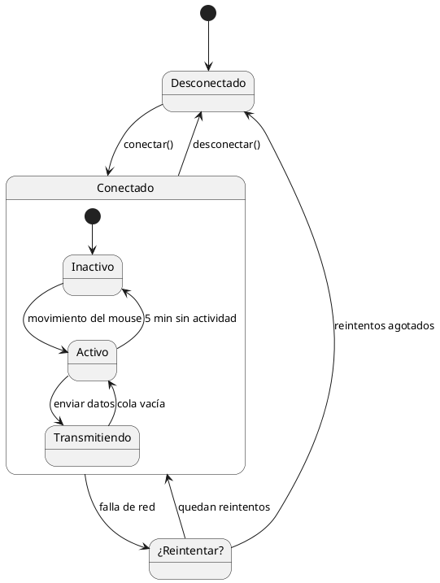
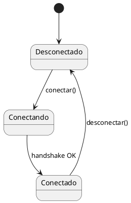
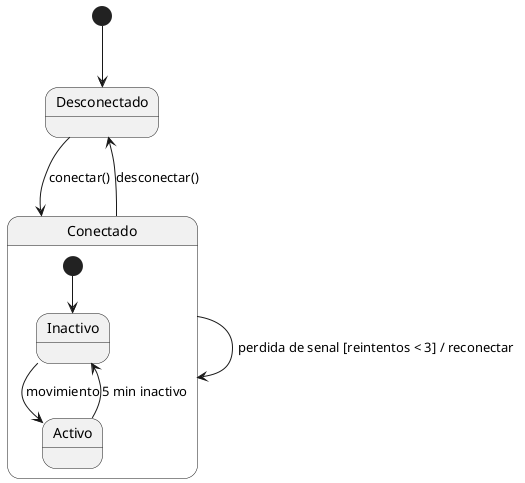
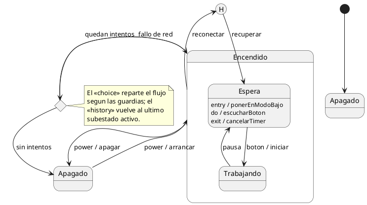

# Diagrama de máquina de estados

## Explicación didáctica

El **diagrama de máquina de estados** (*state machine*) describe la vida de **un solo objeto**: en qué **estados** puede estar y qué **eventos/transiciones** lo hacen pasar de uno a otro. Es la herramienta para modelar objetos con ciclo de vida: pedidos, conexiones, cuentas, máquinas, procesos.

**Cuándo usarlo:**
- Cuando el comportamiento de un objeto depende de **en qué estado está** (no de quién lo llama).
- Para modelar estados con historial, estados compuestos o condiciones complejas.
- Clásicos: estado de un `Pedido`, de una `Conexión`, de un `Cajero`.

**Notación:**
- Estado inicial: `[*] --> Estado`; final: `Estado --> [*]`.
- Transición: `EstadoA --> EstadoB : evento [condición] / acción`.
- **Estado compuesto**: estado que contiene subestados (agrupamiento).
- **Elección** (`choice`): bifurcación con condiciones.
- **Historial**: vuelve al subúltimo estado visitado.

**Lectura de una transición:** *cuando el objeto está en A y recibe el evento E (si se cumple la condición), pasa a B ejecutando la acción entre `/`.*

## Ejemplo 1: Ciclo de vida de un pedido

**Lectura:** *un pedido nace `Nuevo`, se valida, se prepara y se envía; dos caminos terminan mal (`Rechazado`, `Devuelto`) y uno bien (`Entregado`). También puede quedarse en el mismo estado (transición a sí mismo).*

## Ejemplo 2: Conexión con estado compuesto y elección

**Lectura:** *`Conectado` es un estado compuesto con 3 subestados; tras una falla hay una **elección**: si quedan reintentos vuelve a conectarse, si no corta la sesión.*

## Ejemplo completo — construirlo paso a paso

*Objetivo: modelar la conexión de un dispositivo con **toda la notación de estados**: inicial/final, eventos con guardia y acción, estados compuestos, `entry`/`exit`/`do`, elección `<<choice>>`, historia `<<history>>` y nota.*

### Paso 1 — estados y transiciones básicas

**Añade:** nodo inicial `[*]`, estados y transición con **evento** y **acción** (`evento / acción`).

### Paso 2 — guardias y estado compuesto

**Añade:** **guardia** `[condicion]` entre corchetes y **estado compuesto** con sus subestados internos.

### Paso 3 — notación completa (actividades internas, elección e historia)

**Añade:** actividades `entry`/`exit`/`do` dentro del estado, pseudostados `<<choice>>` y `<<history>>`, nodo final `[*]` interno y nota.

**Cómo se lee el Paso 3:** `Espera` ejecuta `do` mientras está activo, dispara `entry`/`exit` al entrar y salir; tras un fallo, `<<choice>>` reparte con guardias y `<<history>>` devuelve al último subestado sin repetir todo el camino.

## Errores comunes

- Poner **acciones del sistema** como estados (*"Esperando respuesta del usuario"* suele ser un estado; *"Mostrar ventana"* es una acción): los estados describen **situaciones**, no pantallas.
- Olvidar el **estado inicial/final**: toda máquina necesita `[*]`.
- Mezclar **muchos objetos** en una máquina de estados: este diagrama sigue la vida de **un** objeto; si hay intercambio de mensajes, usa un diagrama de secuencia.
