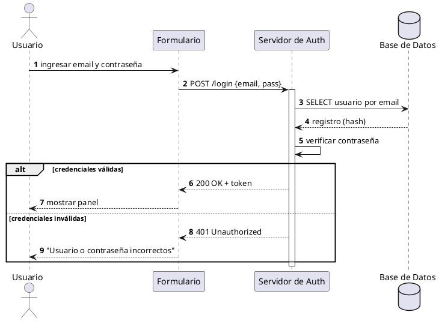
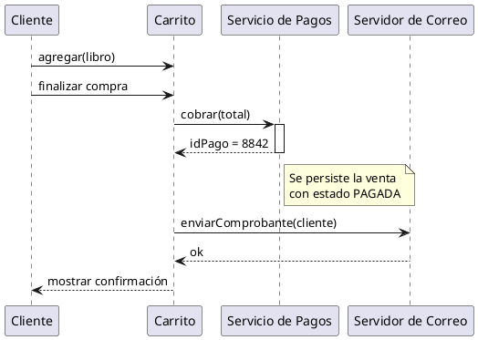
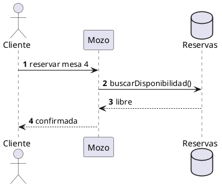
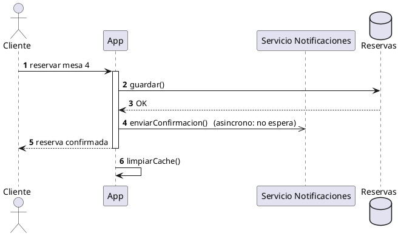
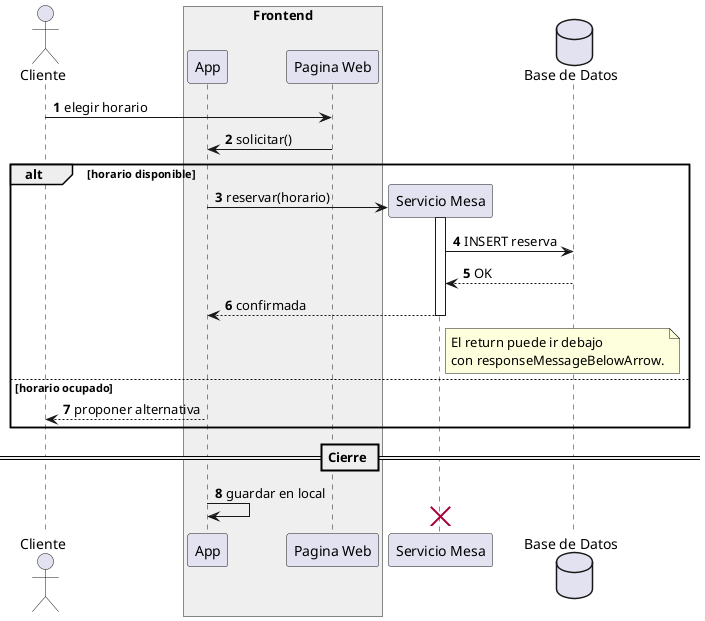

# Diagrama de secuencia

## Explicación didáctica

El **diagrama de secuencia** es el diagrama dinámico más usado: muestra los **mensajes** que se intercambian los objetos **en orden temporal**, de arriba hacia abajo. Cada participante tiene una **línea de vida** (lifeline) vertical y cada mensaje es una flecha horizontal.

**Cuándo usarlo:**
- Para diseñar/detallar **un escenario concreto** de un caso de uso ("¿qué pasa cuando el usuario paga?").
- Para entender y explicar **colaboraciones entre objetos** paso a paso.
- Es el diagrama que mejor traduce a código: cada línea de vida suele ser una clase/objeto real.

**Notación:**
- **Participantes**: `actor`, `participant`, `entity`, `control`, `database`, `boundary`.
- Mensaje **síncrono** `->` (espera respuesta), **asíncrono** `->>` (no espera), retorno `-->`.
- **Activación** (barra de vida activa): `activate` / `deactivate` (o automático con `autonumber`).
- **Fragmentos** (marcos de interacción):
  - `alt/else` = alternativa (if/else)
  - `opt` = opcional
  - `loop` = repetición
  - `par` = paralelo
  - `note over / note left` = notas
- `create X` crea el objeto; `destroy X` lo elimina.
- `autonumber` numera los mensajes automáticamente (útil para explicar).

## Ejemplo 1: Login con alternativa (alt/else)

**Lectura:** *secuencia completa de un login; el fragmento `alt` cubre los dos escenarios posibles (éxito/error) sin necesidad de dos diagramas.*

## Ejemplo 2: Compra con creación de objetos y nota

**Lectura:** *el Carrito orquesta la operación: cobra al Servicio de Pagos, registra una nota con el id y pide el comprobante al servidor de correo antes de responder al Cliente.*

## Ejemplo completo — construirlo paso a paso

*Objetivo: detallar la reserva de una mesa con **toda la notación de secuencia**: tipos de participante, mensajes síncrono/asíncrono/retorno, `activate`, mensajes a sí mismo, `create`/`destroy`, fragmentos, divisores, `box`, notas y numeración automática.*

### Paso 1 — participantes y mensajes

**Añade:** `autonumber`, participantes con tipo (`actor`, `participant`, `database`) y mensaje con retorno `-->`.

### Paso 2 — activación, asíncronos y mensajes a sí mismo

**Añade:** `activate`/`deactivate`, mensaje **asíncrono** `->>` (no espera) y **automensaje** (la flecha que sale y regresa al mismo participante).

### Paso 3 — notación completa (fragmentos, creación/destrucción y estructura)

**Añade:** fragmento `alt/else`, nota sobre mensaje, `create`/`destroy` de participantes, separador de fases `== ... ==`, `box` de agrupación y nota lateral.

**Cómo se lee el Paso 3:** el `box` agrupa los participantes del frontend, `create`/`destroy` marcan cuándo nace y muere el Servicio Mesa, el fragmento `alt` cubre los dos escenarios y el separador `== Cierre ==` divide las fases de tiempo.

## Errores comunes

- Flechas **hacia atrás en el tiempo** (un mensaje que retorna antes de haber ido): el eje vertical es el tiempo.
- Ordenar participantes alfabéticamente: ordénalos por **colaboración** (izquierda = quien inicia).
- Usar secuencia para **todo el sistema**: un diagrama = **un escenario**. Para el diagrama general de clases, usa el diagrama de clases.
