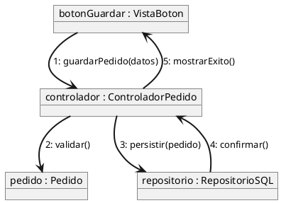
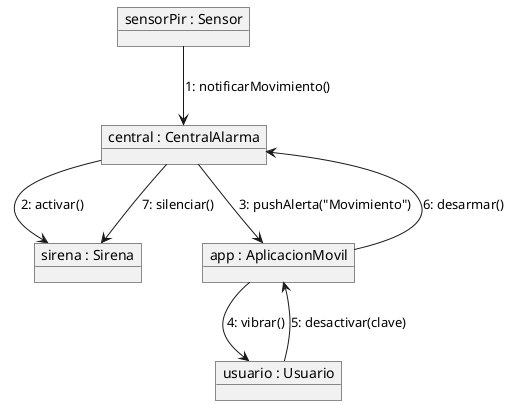
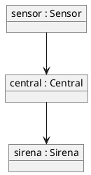
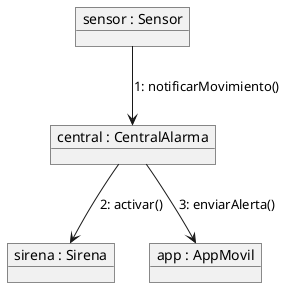
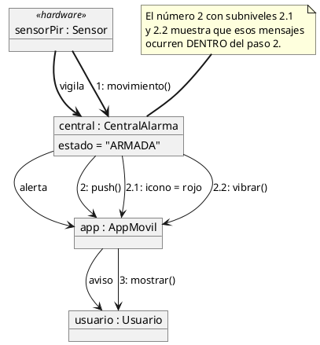

# Diagrama de comunicación

## Explicación didáctica

El **diagrama de comunicación** (*communication*) muestra los **mismos mensajes** que el de secuencia, pero con la visión **estructural**: los objetos aparecen como cajas conectadas por enlaces y los mensajes se escriben **sobre los enlaces**, numerados para indicar el orden. Es el "mapa de quién le habla a quién" en lugar de la "línea de tiempo".

**Cuándo usarlo:**
- Para ver de un vistazo **qué objetos colaboran** y con qué **vínculos** (asociaciones) lo hacen.
- Cuando el **orden temporal es secundario** y lo importante es la topología de la colaboración.
- Complementario al de secuencia: mismo escenario, otra perspectiva.

**Notación:**
- **Objetos** (rectángulos, nombre subrayado o `objeto : Clase`) unidos por **enlaces** (líneas rectas).
- Cada mensaje se anota sobre el enlace con el formato: `número: nombreMensaje(argumentos)`.
- Los mensajes se reenvían sobre los mismos enlaces; si un objeto necesita hablar con otro, **debe existir un enlace** (o una asociación en la clase que los conecte).
- Se pueden añadir `activate/deactivate` mediante notas para marcar activación.

**Diferencia clave con la secuencia:**

| Secuencia | Comunicación |
| --- | --- |
| Eje vertical = **tiempo** | Eje espacial = **colaboración** |
| Se ven retornos y activaciones | Se ven **enlaces/asociaciones** |
| Mejor para **detallar** un flujo | Mejor para ver **estructura** |

## Ejemplo 1: Patrón MVC con mensajes numerados

**Lectura:** *la Vista le avisa al Controlador (1), que valida el Pedido (2), lo persiste en el Repositorio (3), recibe la confirmación (4) y le devuelve el éxito a la Vista (5). El orden está en los números, no en el dibujo.*

## Ejemplo 2: Sistema de alarma con colaboración distribuida

**Lectura:** *siete mensajes numerados que muestran la colaboración completa; el enlace `central-sirena` se usa dos veces (2 y 7), lo que revela que es una asociación reciente en el diseño.*

## Ejemplo completo — construirlo paso a paso

*Objetivo: modelar una alerta de seguridad con **toda la notación de comunicación**: objetos con clase, enlaces con rol, mensajes numerados en varios niveles, estereotipos y notas.*

### Paso 1 — objetos y enlaces

**Añade:** objetos `object "nombre : Clase"` y los **enlaces** (línea recta) por los que viajan los mensajes.

### Paso 2 — mensajes numerados

**Añade:** los mensajes con su **número de orden** escrito sobre el enlace (`n: mensaje()`), que es lo que reconstruye la secuencia.

### Paso 3 — notación completa (numeración jerárquica, roles y notas)

**Añade:** numeración **decimal** para sub-mensajes (`1.1`, `1.2`), **rol** en cada extremo del enlace, estereotipo en el objeto `<<...>>` y nota sobre un enlace.

**Cómo se lee el Paso 3:** los mensajes `2.1` y `2.2` son **hijos** del mensaje `2` (jerarquía decimal); el rol `vigila` sobre el enlace explica qué papel juega cada extremo y la nota fija la regla de lectura.

## Errores comunes

- Poner mensajes entre objetos **sin enlace**: en este diagrama los mensajes viajan **por los enlaces**; si no existe, primero agrega la asociación al diagrama de clases.
- Olvidar la **numeración**: sin números no se puede reconstruir el orden temporal.
- Esperar que muestre **condiciones o bucles**: eso es del diagrama de secuencia (`alt`, `loop`). En comunicación solo verás mensajes numerados.
