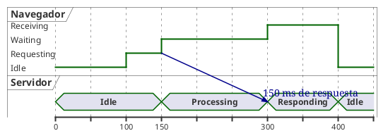
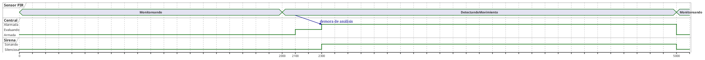

# Diagrama de tiempo

## Explicación didáctica

El **diagrama de tiempo** (*timing*) es un diagrama **cuantitativo**: muestra cómo cambian los **estados de los participantes a lo largo de una línea de tiempo concreta**. A diferencia de la máquina de estados (que dice *qué puede pasar*), el timing dice *cuándo pasa exactamente*: milisegundos, ciclos, unidades de tiempo.

**Cuándo usarlo:**
- Sistemas **en tiempo real**, embebidos, protocolos de red, sensores, audio/video.
- Cuando los requisitos dicen *"en menos de 200 ms"* o *"cada 500 µs"*.
- Para modelar **protocolos de comunicación** (líneas de vida con estados y umbrales).

**Notación (sintaxis PlantUML):**
- `robust "Nombre" as X` → participante con **múltiples estados** visibles.
- `concise "Nombre" as Y` → participante con **un solo estado** a la vez.
- `@0`, `@100`... → **marcas de tiempo** (las unidades las defines tú: ms, µs, s).
- `X is Estado` → el participante X pasa a ese estado en ese instante.
- Se pueden marcar **periodos** con `highlight` y umbrales con `@` sobre un participante.

**Idea clave:** *el eje horizontal es el **tiempo real**; la altura muestra simultáneamente a todos los participantes, así que se ven las **relaciones de causa-efecto** entre ellos.*

## Ejemplo 1: Petición HTTP con tiempos de respuesta

**Lectura:** *a los 100 ms el navegador pide; a los 150 ms el servidor empieza a procesar y el navegador espera; a los 300 ms llega la respuesta: el navegador estuvo esperando 150 ms.*

## Ejemplo 2: Sensor de alarma con estados concisos

**Lectura:** *el sensor detecta a los 2000; la central tarda 300 ms en evaluar y alarmar; la sirena suena 2700 ms y todo vuelve al reposo a los 5000.*

## Errores comunes

- Usar tiempos **sin unidades definidas**: aclara en una nota si `@100` es ms, µs o ciclos de reloj.
- Poner **estados que no existen** en la máquina de estados: cada estado del timing debe corresponder a un estado definido en el diagrama de estados correspondiente.
- Olvidar que el eje es **tiempo**, no orden de mensajes: si necesitas ver mensajes, usa el diagrama de secuencia.
