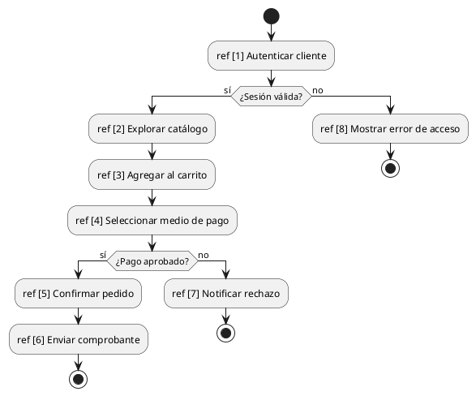
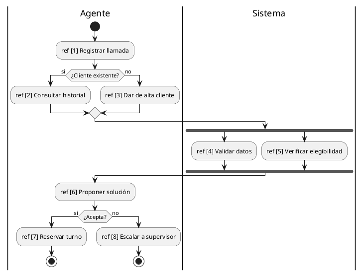

# Diagrama de interacción generalizada

## Explicación didáctica

El **diagrama de interacción generalizada** (*interaction overview*) es un **híbrido**: tiene la forma de un diagrama de actividades (flujo con inicio, decisiones y forks) pero cada **nodo es una interacción completa** (una secuencia, una comunicación...) referenciada con `ref [n]`. Sirve para **orquestar varios escenarios** en una sola vista: "primero ocurre la interacción 1, si sale bien la 2, si no la 3".

**Cuándo usarlo:**
- Cuando un proceso tiene **varias interacciones** y necesitas ver su **flujo de control** en una página.
- Para narrar un caso de uso completo compuesto de múltiples secuencias (ej: *Alta de usuario → Envío de mail → Confirmación*).
- Es menos común que secuencia/actividades, pero aparece en exámenes y en documentación de procesos largos.

**Notación:**
- **Nodos de interacción**: rectángulos o actividades rotuladas `ref [n] Nombre de la interacción`.
- **Flujo de control**: flechas, decisiones (`if`), barras paralelas (`fork`) — la misma notación que actividades.
- El `ref [n]` remite a la secuencia numerada `n` descrita en otro diagrama.

**Regla de oro:** *el interaction overview **no** detalla los mensajes; los delega en las interacciones referenciadas. Si necesitas ver los mensajes, abrí la secuencia `ref [n]`.*

## Ejemplo 1: Proceso de compra en línea

**Lectura:** *ocho interacciones encadenadas; el diagrama muestra **el flujo y sus puntos de decisión**, mientras que los mensajes concretos viven en cada secuencia referenciada.*

## Ejemplo 2: Atención telefónica con ramas paralelas

**Lectura:** *la llamada se registra, se bifurca según si el cliente es nuevo o no, luego dos validaciones corren **en paralelo** y el flujo se sincroniza antes de proponer la solución.*

## Errores comunes

- Escribir **mensajes dentro del nodo de interacción**: el nodo solo **referencia** la interacción; los mensajes van en la secuencia `ref`.
- Numerar los `ref` **sin definirlos**: cada `ref [n]` debe existir como diagrama de secuencia en la documentación.
- Usarlo cuando **un solo diagrama de secuencia alcanza**: si el proceso es corto, la secuencia simple es más clara.
