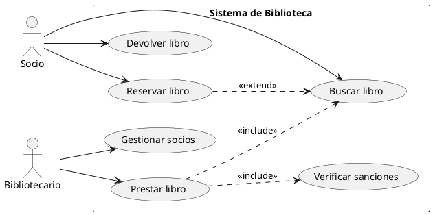
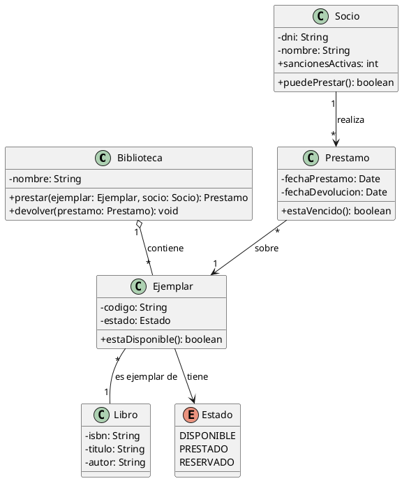
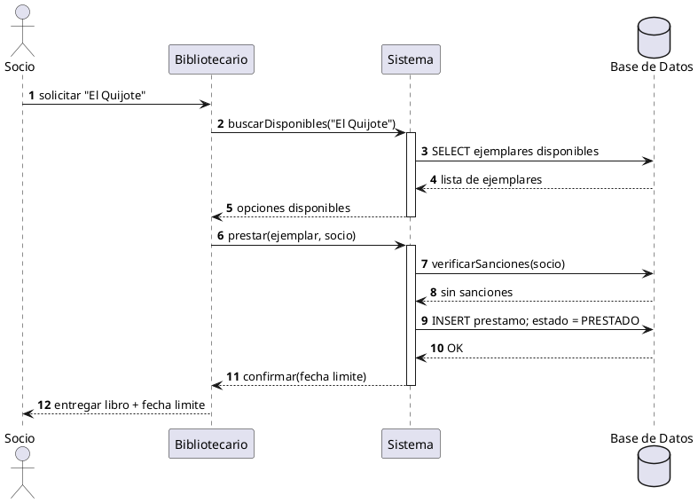

# Ejemplo completo: armar un sistema paso a paso

Este ejemplo enseña a **armar un modelo UML desde cero** sobre un caso real: una **biblioteca**. Verás cada paso con su **notación textual** (código PlantUML, que puedes copiar) y su **notación visual** (el diagrama que se genera automáticamente).

**El encargo:** *los socios buscan y reservan libros; el bibliotecario presta y recibe devoluciones; el sistema debe impedir prestar a quien tenga sanciones.*

## Notación textual vs. visual

Todo en UML tiene dos caras: lo que **escribes** (texto) y lo que **se dibuja** (símbolo). Esta es la clave de leer y escribir diagramas:

| Qué expresa | Notación textual (PlantUML) | Notación visual (en el diagrama) |
| --- | --- | --- |
| Clase | `class Libro { - isbn: String }` | Rectángulo de 3 compartimentos |
| Atributo / método | `- isbn: String` / `+ buscar(): Libro` | Filas 2 y 3 del rectángulo |
| Asociación | `Socio --> Prestamo` | Línea continua entre clases |
| Multiplicidad | `Socio "1" --> "*" Prestamo` | `1` y `*` en los extremos de la línea |
| Herencia | `Ebook --\|> Libro` | Triángulo vacío hacia la clase padre |
| Agregación | `Biblioteca o-- Ejemplar` | Rombito **hueco** (relación débil) |
| Composición | `Prestamo *-- Linea` | Rombito **relleno** (parte no separable) |
| Dependencia | `A ..> B` | Flecha **discontinua** |
| Realización | `A ..\|> Interfaz` | Triángulo vacío + línea discontinua |
| Actor | `actor Socio` | Figura de palito |
| Caso de uso | `usecase "Prestar libro"` | Elipse |
| Nota | `note right: texto` | Recuadro con texto |

> [!tip] Regla de oro
> Si no sabes qué símbolo usar, pregúntate **qué tipo de relación es**: ¿*es un*? (herencia) ¿*está compuesto por*? (composición) ¿*usa*? (dependencia) ¿*solo colabora*? (asociación).

## Paso 1 — Alcance: casos de uso

Antes de dibujar clases, define **qué hace el sistema** con sus actores. Sustantivos → futuras clases; verbos → futuros métodos o casos de uso.

**Notación textual:**

**Notación visual:** (el código anterior se compila solo; pulsa "Ver codigo PlantUML" para verlo)

**Qué se ve y cómo se lee:**
- `<<include>>`: prestar **siempre** verifica sanciones y busca el libro (obligatorio).
- `<<extend>>`: reservar **puede ocurrir** después de buscar (opcional, con condición).
- La flecha va **del caso que extiende/al incluye → al caso base**.

## Paso 2 — Estructura: diagrama de clases

Del texto del encargo salen las entidades: **Libro** (catálogo), **Ejemplar** (el ejemplar físico), **Socio**, **Prestamo** y **Biblioteca**. Los verbos (`prestar`, `devolver`) se vuelven **métodos**; las cantidades ("un socio tiene muchos préstamos") se vuelven **multiplicidades**.

**Notación textual:**

**Notación visual:** (pulsa "Ver codigo PlantUML" para ver el código)

**Qué se ve y cómo se lee:**
- `o--` con `1` y `*`: una Biblioteca **agrega** muchos Ejemplares (el Ejemplar existe aunque cambie de biblioteca → rombo hueco).
- `Socio "1" --> "*" Prestamo`: un socio realiza de 0 a muchos préstamos.
- Traducción a código: la multiplicidad `*` del lado de `Prestamo` en `Socio` se convierte en `List<Prestamo>` en la clase `Socio`.

## Paso 3 — Comportamiento: secuencia de un préstamo

Las clases por separado no cuentan la historia. Elige el **caso de uso central** (prestar) y detalla los mensajes paso a paso.

**Notación textual:**

**Notación visual:** (pulsa "Ver codigo PlantUML" para ver el código)

**Qué se ve y cómo se lee:**
- Cada caja vertical = un participante; el orden de arriba hacia abajo = el **tiempo**.
- `activate/deactivate` = la barra de vida activa (quién está trabajando en ese momento).
- `alt/else` añadiría ramas (aquí el camino es feliz, ya validado en el paso 1).

## Checklist para armar tu propio diagrama

1. **Escribe el problema en una frase** (como el encargo de arriba).
2. **Subraya sustantivos** → clases/casos de uso; **verbos** → métodos/mensajes.
3. **Subraya cantidades** ("muchos", "uno por cada") → multiplicidades.
4. Elige el diagrama según la pregunta: *¿qué existe?* → clases; *¿qué hace el usuario?* → casos de uso; *¿en qué orden?* → secuencia.
5. Copia un ejemplo de este cuaderno, pégalo en el [PlantUML Online Server](https://www.plantuml.com/plantuml/uml) y **rompélo**: cambiar un `--\|>` por `..>` y ver qué pasa es la mejor forma de aprender.
6. No hace falta instalar nada: guarda solo el código y la imagen la genera la web automáticamente.

Siguiente: estudia los [[01-diagrama-de-clases|14 diagramas oficiales]] con sus 28 ejemplos.
